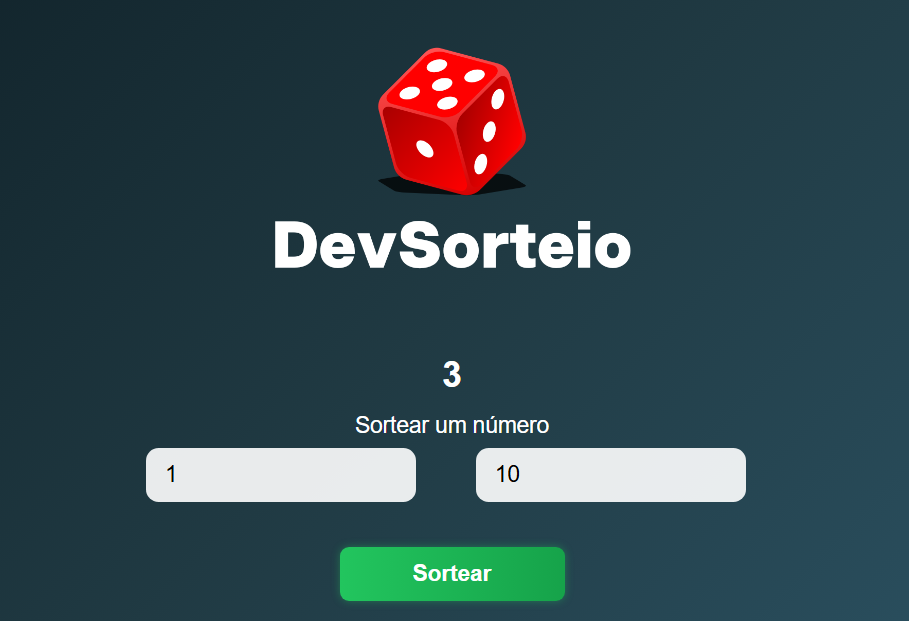

# 🎲 Sorteador de Números

Projeto simples que gera um número aleatório entre um valor mínimo e máximo escolhidos pelo usuário.

---

## 💡 Por que fiz?

Quis praticar JavaScript criando algo que realmente usasse lógica.
Esse projeto me ajudou a entender melhor como funciona o Math.random() e a manipulação do DOM.

---

## 🚀 Tecnologias

  
  
  

---

## 🧠 O que pratiquei
- Lógica com `if/else`
- `Math.random( )`
- Manipulação de elementos com `querySelector`
- Eventos com `addEventListener`
  
---

## 📱 Responsividade
Funciona no celular e no desktop.

---

## 📸 Preview

  

